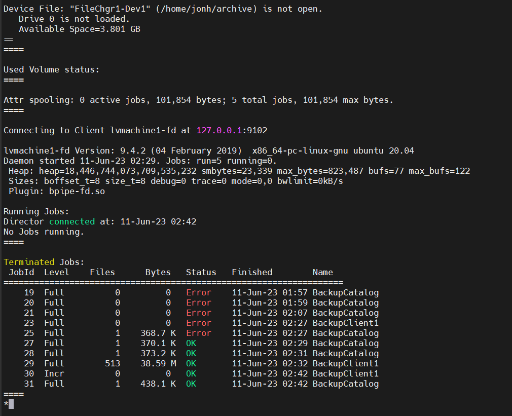
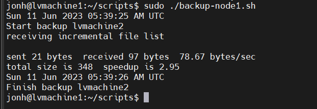
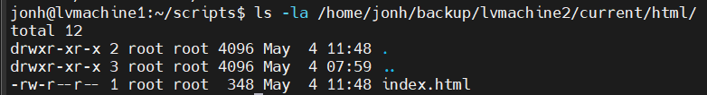

### Задание 1

В чём разница между:

- полным резервным копированием,
- дифференциальным резервным копированием,
- инкрементным резервным копированием.

*Приведите ответ в свободной форме.*

---
Полное резервное копирование :
- Самый долгий с точки зрения процесса
- Дает нагрузку на диски и на сеть, если она сетевая
- Самый надежный и быстрый с точки зрения восстановления
данных.

Принцып работы дифференциального резервного
копирования - сначала делается полное резервное копирование,
затем при каждом запуске процесса резервируются только
измененные данные, но точкой отсчета является состояние
времени полного бэкапа.

Инкрементное копирование - работает как дифференцированное
копирование, но в отличии от него бэкапятся данные, которые
были изменены из последнего слепка, то есть отправная точка
каждого нового бэкапа это бэкап n-1.

В итоге, полное резервное копирование копирует все данные,
дифференциальное копирование копирует только измененные данные
после последнего полного резервного копирования, а инкрементное
копирование копирует только измененные данные после последнего
резервного копирования (может быть полным, дифференциальным или инкрементным)

---
### Задание 2

Установите программное обеспечении Bacula, настройте bacula-dir, bacula-sd,  bacula-fd. Протестируйте работу сервисов.

*Пришлите:*
*- конфигурационные файлы для bacula-dir, bacula-sd,  bacula-fd,*
*- скриншот, подтверждающий успешное прохождение резервного копирования.*

---
bacula-dir
```
# Default Bacula Director Configuration file
#
#  The only thing that MUST be changed is to add one or more
#   file or directory names in the Include directive of the
#   FileSet resource.
#
#  For Bacula release 9.4.2 (04 February 2019) -- ubuntu 20.04
#
#  You might also want to change the default email address
#   from root to your address.  See the "mail" and "operator"
#   directives in the Messages resource.
#
# Copyright (C) 2000-2017 Kern Sibbald
# License: BSD 2-Clause; see file LICENSE-FOSS
#

Director {                            # define myself
  Name = lvmachine1-dir
  DIRport = 9101                # where we listen for UA connections
  QueryFile = "/etc/bacula/scripts/query.sql"
  WorkingDirectory = "/var/lib/bacula"
  PidDirectory = "/run/bacula"
  Maximum Concurrent Jobs = 20
  Password = "pEQ8abWJvRHpOYaRRWfcdTybw_CDjh6DM"         # Console password
  Messages = Daemon
  DirAddress = localhost
}

JobDefs {
  Name = "DefaultJob"
 Type = Backup
  Level = Incremental
  Client = lvmachine1-fd
  FileSet = "Full Set"
  Schedule = "WeeklyCycle"
  Storage = File1
  Messages = Standard
  Pool = File
  SpoolAttributes = yes
  Priority = 10
  Write Bootstrap = "/var/lib/bacula/%c.bsr"
}


#
# Define the main nightly save backup job
#   By default, this job will back up to disk in /nonexistant/path/to/file/archive/dir
Job {
  Name = "BackupClient1"
  JobDefs = "DefaultJob"
}

#Job {
#  Name = "BackupClient2"
#  Client = lvmachine12-fd
#  JobDefs = "DefaultJob"
#}

#Job {
#  Name = "BackupClient1-to-Tape"
#  JobDefs = "DefaultJob"
#  Storage = LTO-4
#  Spool Data = yes    # Avoid shoe-shine
#  Pool = Default
#}

#}

# Backup the catalog database (after the nightly save)
Job {
  Name = "BackupCatalog"
  JobDefs = "DefaultJob"
  Level = Full
  FileSet="Catalog"
  Schedule = "WeeklyCycleAfterBackup"
  # This creates an ASCII copy of the catalog
  # Arguments to make_catalog_backup.pl are:
  #  make_catalog_backup.pl <catalog-name>
  RunBeforeJob = "/etc/bacula/scripts/make_catalog_backup.pl MyCatalog"
  # This deletes the copy of the catalog
  RunAfterJob  = "/etc/bacula/scripts/delete_catalog_backup"
  Write Bootstrap = "/var/lib/bacula/%n.bsr"
  Priority = 11                   # run after main backup
}

#
# Standard Restore template, to be changed by Console program
#  Only one such job is needed for all Jobs/Clients/Storage ...
#
Job {
  Name = "RestoreFiles"
  Type = Restore
  Client=lvmachine1-fd
  Storage = File1
# The FileSet and Pool directives are not used by Restore Jobs
# but must not be removed
  FileSet="Full Set"
  Pool = File
  Messages = Standard
  Where = /home/jonh/archive
}


# List of files to be backed up
FileSet {
  Name = "Full Set"
  Include {
    Options {
      signature = MD5
    }
#
#  Put your list of files here, preceded by 'File =', one per line
#    or include an external list with:
#
#    File = <file-name
#
#  Note: / backs up everything on the root partition.
#    if you have other partitions such as /usr or /home
#    you will probably want to add them too.
#
#  By default this is defined to point to the Bacula binary
#    directory to give a reasonable FileSet to backup to
#    disk storage during initial testing.
#
    File = /usr/sbin
  }

#
# If you backup the root directory, the following two excluded
#   files can be useful
#
  Exclude {
    File = /var/lib/bacula
    File = /home/jonh/archive
    File = /proc
    File = /tmp
    File = /sys
    File = /.journal
    File = /.fsck
  }
}

#
# When to do the backups, full backup on first sunday of the month,
#  differential (i.e. incremental since full) every other sunday,
#  and incremental backups other days
Schedule {
  Name = "WeeklyCycle"
  Run = Full 1st sun at 23:05
  Run = Differential 2nd-5th sun at 23:05
  Run = Incremental mon-sat at 23:05
}

# This schedule does the catalog. It starts after the WeeklyCycle
Schedule {
  Name = "WeeklyCycleAfterBackup"
  Run = Full sun-sat at 23:10
}

# This is the backup of the catalog
FileSet {
  Name = "Catalog"
  Include {
    Options {
      signature = MD5
    }
    File = "/var/lib/bacula/bacula.sql"
  }
}

# Client (File Services) to backup
Client {
  Name = lvmachine1-fd
  Address = 127.0.0.1
  FDPort = 9102
  Catalog = MyCatalog
  Password = "w2qSNxIQLEWwqmh6fodezB7UqZrYh2ScQ"          # password for FileDaemon
  File Retention = 60 days            # 60 days
  Job Retention = 6 months            # six months
  AutoPrune = yes                     # Prune expired Jobs/Files
}

#
# Second Client (File Services) to backup
#  You should change Name, Address, and Password before using
#
#Client {
#  Name = lvmachine12-fd
#  Address = localhost2
#  FDPort = 9102
#  Catalog = MyCatalog
#  Password = "w2qSNxIQLEWwqmh6fodezB7UqZrYh2ScQ2"        # password for FileDaemon 2
#  File Retention = 60 days           # 60 days
#  Job Retention = 6 months           # six months
#  AutoPrune = yes                    # Prune expired Jobs/Files
#}


# Definition of file Virtual Autochanger device
Autochanger {
  Name = File1
# Do not use "localhost" here
  Address = 127.0.0.1                # N.B. Use a fully qualified name here
  SDPort = 9103
  Password = "cYbiyNtyYViEIDa4heFfoiD2waluSDrXb"
  Device = FileChgr1
  Media Type = File1
  Maximum Concurrent Jobs = 10        # run up to 10 jobs a the same time
  Autochanger = File1                 # point to ourself
}

# Definition of a second file Virtual Autochanger device
#   Possibly pointing to a different disk drive
#Autochanger {
#  Name = File2
# Do not use "localhost" here
#  Address = 127.0.0.1               # N.B. Use a fully qualified name here
#  SDPort = 9103
#  Password = "cYbiyNtyYViEIDa4heFfoiD2waluSDrXb"
#  Device = FileChgr2
#  Media Type = File2
#  Autochanger = File2                 # point to ourself
#  Maximum Concurrent Jobs = 10        # run up to 10 jobs a the same time
#}

# Definition of LTO-4 tape Autochanger device
#Autochanger {
#  Name = LTO-4
#  Do not use "localhost" here
#  Address = localhost               # N.B. Use a fully qualified name here
#  SDPort = 9103
#  Password = "cYbiyNtyYViEIDa4heFfoiD2waluSDrXb"         # password for Storage daemon
#  Device = LTO-4                     # must be same as Device in Storage daemon
#  Media Type = LTO-4                 # must be same as MediaType in Storage daemon
#  Autochanger = LTO-4                # enable for autochanger device
#  Maximum Concurrent Jobs = 10
#}

# Generic catalog service
Catalog {
  Name = MyCatalog
  dbname = "bacula"; DB Address = "127.0.0.1"; dbuser = "bacula"; dbpassword = "123456789"
}

# Reasonable message delivery -- send most everything to email address
#  and to the console
Messages {
  Name = Standard
#
# NOTE! If you send to two email or more email addresses, you will need
#  to replace the %r in the from field (-f part) with a single valid
#  email address in both the mailcommand and the operatorcommand.
#  What this does is, it sets the email address that emails would display
#  in the FROM field, which is by default the same email as they're being
#  sent to.  However, if you send email to more than one address, then
#  you'll have to set the FROM address manually, to a single address.
#  for example, a 'no-reply@mydomain.com', is better since that tends to
#  tell (most) people that its coming from an automated source.

#
  mailcommand = "/usr/sbin/bsmtp -h 127.0.0.1 -f \"\(Bacula\) \<%r\>\" -s \"Bacula: %t %e of %c %l\" %r"
  operatorcommand = "/usr/sbin/bsmtp -h 127.0.0.1 -f \"\(Bacula\) \<%r\>\" -s \"Bacula: Intervention needed for %j\" %r"
  mail = root = all, !skipped
  operator = root = mount
  console = all, !skipped, !saved
#
# WARNING! the following will create a file that you must cycle from
#          time to time as it will grow indefinitely. However, it will
#          also keep all your messages if they scroll off the console.
#
  append = "/var/log/bacula/bacula.log" = all, !skipped
  catalog = all
}


#
# Message delivery for daemon messages (no job).
Messages {
  Name = Daemon
  mailcommand = "/usr/sbin/bsmtp -h 127.0.0.1 -f \"\(Bacula\) \<%r\>\" -s \"Bacula daemon message\" %r"
  mail = root = all, !skipped
  console = all, !skipped, !saved
  append = "/var/log/bacula/bacula.log" = all, !skipped
}

# Default pool definition
Pool {
  Name = Default
  Pool Type = Backup
  Recycle = yes                       # Bacula can automatically recycle Volumes
  AutoPrune = yes                     # Prune expired volumes
  Volume Retention = 365 days         # one year
  Maximum Volume Bytes = 50G          # Limit Volume size to something reasonable
  Maximum Volumes = 100               # Limit number of Volumes in Pool
}

# File Pool definition
Pool {
  Name = File
  Pool Type = Backup
  Recycle = yes                       # Bacula can automatically recycle Volumes
  AutoPrune = yes                     # Prune expired volumes
  Volume Retention = 365 days         # one year
  Maximum Volume Bytes = 50G          # Limit Volume size to something reasonable
  Maximum Volumes = 100               # Limit number of Volumes in Pool
  Label Format = "Vol-"               # Auto label
}


# Scratch pool definition
Pool {
  Name = Scratch
  Pool Type = Backup
}

#
# Restricted console used by tray-monitor to get the status of the director
#
Console {
  Name = lvmachine1-mon
  Password = "8Xa--ga1iXUo0h_hLdHFb1iU5gXWXJjQM"
  CommandACL = status, .status
}

```
bacula-sd
```
# Default Bacula Storage Daemon Configuration file
#
#  For Bacula release 9.4.2 (04 February 2019) -- ubuntu 20.04
#
# You may need to change the name of your tape drive
#   on the "Archive Device" directive in the Device
#   resource.  If you change the Name and/or the
#   "Media Type" in the Device resource, please ensure
#   that dird.conf has corresponding changes.
#
#
# Copyright (C) 2000-2017 Kern Sibbald
# License: BSD 2-Clause; see file LICENSE-FOSS
#

Storage {                             # definition of myself
  Name = lvmachine1-sd
  SDPort = 9103                  # Director's port
  WorkingDirectory = "/var/lib/bacula"
  Pid Directory = "/run/bacula"
  Plugin Directory = "/usr/lib/bacula"
  Maximum Concurrent Jobs = 20
  SDAddress = 127.0.0.1
}

#
# List Directors who are permitted to contact Storage daemon
#
Director {
  Name = lvmachine1-dir
  Password = "cYbiyNtyYViEIDa4heFfoiD2waluSDrXb"
}

#
# Restricted Director, used by tray-monitor to get the
#   status of the storage daemon
#
Director {
  Name = lvmachine1-mon
  Password = "BAZ868lqAOPofY4Q7uRMb0ubCMEd0yR-d"
  Monitor = yes
}

#
# Note, for a list of additional Device templates please
#  see the directory <bacula-source>/examples/devices
# Or follow the following link:
#  http://www.bacula.org/git/cgit.cgi/bacula/tree/bacula/examples/devices?h=Branch-7.4
#

#
# Devices supported by this Storage daemon
# To connect, the Director's bacula-dir.conf must have the
#  same Name and MediaType.
#

#
# Define a Virtual autochanger
#
Autochanger {
  Name = FileChgr1
  Device = FileChgr1-Dev1
  Changer Command = ""
  Changer Device = /dev/null
}

Device {
  Name = FileChgr1-Dev1
  Media Type = File1
  Archive Device = /home/jonh/archive
  LabelMedia = yes;                   # lets Bacula label unlabeled media
  Random Access = Yes;
  AutomaticMount = yes;               # when device opened, read it
  RemovableMedia = no;
  AlwaysOpen = no;
  Maximum Concurrent Jobs = 5
}

#Device {
#  Name = FileChgr1-Dev2
#  Media Type = File1
#  Archive Device = /home/jonh/archive2
#  LabelMedia = yes;                   # lets Bacula label unlabeled media
#  Random Access = Yes;
#  AutomaticMount = yes;               # when device opened, read it
#  RemovableMedia = no;
#  AlwaysOpen = no;
#  Maximum Concurrent Jobs = 5
#}

#
# Define a second Virtual autochanger
#
#Autochanger {
#  Name = FileChgr2
#  Device = FileChgr2-Dev1, FileChgr2-Dev2
#  Changer Command = ""
#  Changer Device = /dev/null
#}

#Device {
#  Name = FileChgr2-Dev1
#  Media Type = File2
#  Archive Device = /var/bacula/archive
#  LabelMedia = yes;                   # lets Bacula label unlabeled media
#  Random Access = Yes;
#  AutomaticMount = yes;               # when device opened, read it
#  RemovableMedia = no;
#  AlwaysOpen = no;
#  Maximum Concurrent Jobs = 5
#}

#Device {
#  Name = FileChgr2-Dev2
#  Media Type = File2
#  Archive Device = /var/bacula/archive
#  LabelMedia = yes;                   # lets Bacula label unlabeled media
#  Random Access = Yes;
#  AutomaticMount = yes;               # when device opened, read it
#  RemovableMedia = no;
#  AlwaysOpen = no;
#  Maximum Concurrent Jobs = 5
#}


#
# An autochanger device with two drives
#
#Autochanger {
#  Name = Autochanger
#  Device = Drive-1
#  Device = Drive-2
#  Changer Command = "/etc/bacula/scripts/mtx-changer %c %o %S %a %d"
#  Changer Device = /dev/sg0
#}

#Device {
#  Name = Drive-1                      #
#  Drive Index = 0
#  Media Type = DLT-8000
#  Archive Device = /dev/nst0
#  AutomaticMount = yes;               # when device opened, read it
#  AlwaysOpen = yes;
#  RemovableMedia = yes;
#  RandomAccess = no;
#  AutoChanger = yes
#  #
#  # New alert command in Bacula 9.0.0
#  #  Note: you must have the sg3_utils (rpms) or the
#  #        sg3-utils (deb) installed on your system.
#  #        and you must set the correct control device that
#  #        corresponds to the Archive Device
#  Control Device = /dev/sg?? # must be SCSI ctl for /dev/nst0
#  Alert Command = "/etc/bacula/scripts/tapealert %l"
#
#  #
#  # Enable the Alert command only if you have the mtx package loaded
#  # Note, apparently on some systems, tapeinfo resets the SCSI controller
#  #  thus if you turn this on, make sure it does not reset your SCSI
#  #  controller.  I have never had any problems, and smartctl does
#  #  not seem to cause such problems.
#  #
#  Alert Command = "sh -c 'tapeinfo -f %c |grep TapeAlert|cat'"
#  If you have smartctl, enable this, it has more info than tapeinfo
#  Alert Command = "sh -c 'smartctl -H -l error %c'"
#}

#Device {
#  Name = Drive-2                      #
#  Drive Index = 1
#  Media Type = DLT-8000
#  Archive Device = /dev/nst1
#  AutomaticMount = yes;               # when device opened, read it
#  AlwaysOpen = yes;
#  RemovableMedia = yes;
#  RandomAccess = no;
#  AutoChanger = yes
#  # Enable the Alert command only if you have the mtx package loaded
#  Alert Command = "sh -c 'tapeinfo -f %c |grep TapeAlert|cat'"
#  If you have smartctl, enable this, it has more info than tapeinfo
#  Alert Command = "sh -c 'smartctl -H -l error %c'"
#}

#
# A Linux or Solaris LTO-2 tape drive
#
#Device {
#  Name = LTO-2
#  Media Type = LTO-2
#  Archive Device = /dev/nst0
#  AutomaticMount = yes;               # when device opened, read it
#  AlwaysOpen = yes;
#  RemovableMedia = yes;
#  RandomAccess = no;
#  Maximum File Size = 3GB
## Changer Command = "/etc/bacula/scripts/mtx-changer %c %o %S %a %d"
## Changer Device = /dev/sg0
## AutoChanger = yes
#  # Enable the Alert command only if you have the mtx package loaded
## Alert Command = "sh -c 'tapeinfo -f %c |grep TapeAlert|cat'"
## If you have smartctl, enable this, it has more info than tapeinfo
## Alert Command = "sh -c 'smartctl -H -l error %c'"
#}

#
# A Linux or Solaris LTO-3 tape drive
#
#Device {
#  Name = LTO-3
#  Media Type = LTO-3
#  Archive Device = /dev/nst0
#  AutomaticMount = yes;               # when device opened, read it
#  AlwaysOpen = yes;
#  RemovableMedia = yes;
#  RandomAccess = no;
#  Maximum File Size = 4GB
# Changer Command = "/etc/bacula/scripts/mtx-changer %c %o %S %a %d"
# Changer Device = /dev/sg0
# AutoChanger = yes
#  #
#  # New alert command in Bacula 9.0.0
#  #  Note: you must have the sg3_utils (rpms) or the
#  #        sg3-utils (deb) installed on your system.
#  #        and you must set the correct control device that
#  #        corresponds to the Archive Device
#  Control Device = /dev/sg??  # must be SCSI ctl for /dev/nst0
#  Alert Command = "/etc/bacula/scripts/tapealert %l"
#
#  # Enable the Alert command only if you have the mtx package loaded
## Alert Command = "sh -c 'tapeinfo -f %c |grep TapeAlert|cat'"
## If you have smartctl, enable this, it has more info than tapeinfo
## Alert Command = "sh -c 'smartctl -H -l error %c'"
#}

#
# A Linux or Solaris LTO-4 tape drive
#
#Device {
#  Name = LTO-4
#  Media Type = LTO-4
#  Archive Device = /dev/nst0
#  AutomaticMount = yes;               # when device opened, read it
#  AlwaysOpen = yes;
#  RemovableMedia = yes;
#  RandomAccess = no;
#  Maximum File Size = 5GB
# Changer Command = "/etc/bacula/scripts/mtx-changer %c %o %S %a %d"
# Changer Device = /dev/sg0
# AutoChanger = yes
#  #
#  # New alert command in Bacula 9.0.0
#  #  Note: you must have the sg3_utils (rpms) or the
#  #        sg3-utils (deb) installed on your system.
#  #        and you must set the correct control device that
#  #        corresponds to the Archive Device
#  Control Device = /dev/sg??  # must be SCSI ctl for /dev/nst0
#  Alert Command = "/etc/bacula/scripts/tapealert %l"
#
#  # Enable the Alert command only if you have the mtx package loaded
## Alert Command = "sh -c 'tapeinfo -f %c |grep TapeAlert|cat'"
## If you have smartctl, enable this, it has more info than tapeinfo
## Alert Command = "sh -c 'smartctl -H -l error %c'"
#}

#
# An HP-UX tape drive
#
#Device {
#  Name = Drive-1                      #
#  Drive Index = 0
#  Media Type = DLT-8000
#  Archive Device = /dev/rmt/1mnb
#  AutomaticMount = yes;               # when device opened, read it
#  AlwaysOpen = yes;
#  RemovableMedia = yes;
#  RandomAccess = no;
#  AutoChanger = no
#  Two EOF = yes
#  Hardware End of Medium = no
#  Fast Forward Space File = no
#  #
#  # New alert command in Bacula 9.0.0
#  #  Note: you must have the sg3_utils (rpms) or the
#  #        sg3-utils (deb) installed on your system.
#  #        and you must set the correct control device that
#  #        corresponds to the Archive Device
#  Control Device = /dev/sg??  # must be SCSI ctl for /dev/rmt/1mnb
#  Alert Command = "/etc/bacula/scripts/tapealert %l"
#
#  #
#  # Enable the Alert command only if you have the mtx package loaded
#  Alert Command = "sh -c 'tapeinfo -f %c |grep TapeAlert|cat'"
#  If you have smartctl, enable this, it has more info than tapeinfo
#  Alert Command = "sh -c 'smartctl -H -l error %c'"
#}

#
# A FreeBSD tape drive
#
#Device {
#  Name = DDS-4
#  Description = "DDS-4 for FreeBSD"
#  Media Type = DDS-4
#  Archive Device = /dev/nsa1
#  AutomaticMount = yes;               # when device opened, read it
#  AlwaysOpen = yes
#  Offline On Unmount = no
#  Hardware End of Medium = no
#  BSF at EOM = yes
#  Backward Space Record = no
#  Fast Forward Space File = no
#  TWO EOF = yes
#  #
#  # New alert command in Bacula 9.0.0
#  #  Note: you must have the sg3_utils (rpms) or the
#  #        sg3-utils (deb) installed on your system.
#  #        and you must set the correct control device that
#  #        corresponds to the Archive Device
#  Control Device = /dev/sg??  # must be SCSI ctl for /dev/nsa1
#  Alert Command = "/etc/bacula/scripts/tapealert %l"
#
#  If you have smartctl, enable this, it has more info than tapeinfo
#  Alert Command = "sh -c 'smartctl -H -l error %c'"
#}

#
# Send all messages to the Director,
# mount messages also are sent to the email address
#
Messages {
  Name = Standard
  director = lvmachine1-dir = all
}
```
bacula-fd
```
# Default  Bacula File Daemon Configuration file
#
#  For Bacula release 9.4.2 (04 February 2019) -- ubuntu 20.04
#
# There is not much to change here except perhaps the
# File daemon Name to
#
#
# Copyright (C) 2000-2015 Kern Sibbald
# License: BSD 2-Clause; see file LICENSE-FOSS
#

#
# List Directors who are permitted to contact this File daemon
#
Director {
  Name = lvmachine1-dir
  Password = "w2qSNxIQLEWwqmh6fodezB7UqZrYh2ScQ"
}

#
# Restricted Director, used by tray-monitor to get the
#   status of the file daemon
#
Director {
  Name = lvmachine1-mon
  Password = "LYbm_jCSkTAn4u1zC9T6PIeTI1_e4nO6E"
  Monitor = yes
}

#
# "Global" File daemon configuration specifications
#
FileDaemon {                          # this is me
  Name = lvmachine1-fd
  FDport = 9102                  # where we listen for the director
  WorkingDirectory = /var/lib/bacula
  Pid Directory = /run/bacula
  Maximum Concurrent Jobs = 20
  Plugin Directory = /usr/lib/bacula
  FDAddress = 127.0.0.1
}

# Send all messages except skipped files back to Director
Messages {
  Name = Standard
  director = lvmachine1-dir = all, !skipped, !restored
}

```


---
### Задание 3

Установите программное обеспечении Rsync. Настройте синхронизацию на двух нодах. Протестируйте работу сервиса.

*Пришлите рабочую конфигурацию сервера и клиента Rsync блоком кода в вашем md-файле.*

---




lvmachine2 server ( /etc/rsync.conf )
```
pid file = /var/run/rsyncd.pid
log file = /var/log/rsyncd.log
transfer logging = true
munge symlinks = yes

[data]
path = /var/www
uid = root
read only = yes
list = yes
comment = Data backup Dir
auth users = backup
secrets file = /etc/rsyncd.scrt
```
lvmachine1 client ( /etc/rsync.conf )
```
pid file = /var/run/rsyncd.pid
log file = /var/log/rsyncd.log
transfer logging = true
munge symlinks = yes
```
