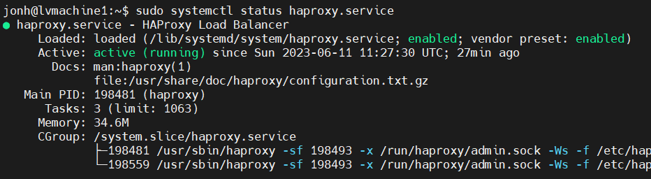

### Задание 1

Что такое балансировка нагрузки и зачем она нужна?

*Приведите ответ в свободной форме.*

---
Балансировка нагрузки (load balancing) — это процесс
распределения нагрузки на пул серверов , чтобы обеспечить эффективное использование ресурсов, повысить производительность системы и обеспечить надежность и отказоустойчивость.

Основные преимущества балансировки нагрузки включают:
- сокращение времени простоя
- масштабируемость
- отказоустойчивость
- эффективное использование ресурсов

---
### Задание 2

Чем отличаются алгоритмы балансировки Round Robin и Weighted Round Robin? В каких случаях каждый из них лучше применять?

*Приведите ответ в свободной форме.*

---
Round Robin - тот алгоритм равномерно распределяет запросы между серверами в кластере. Он работает по принципу "поочередности", где каждый сервер получает запрос в последовательном порядке.

Weighted Round Robin (WRR) - в отличие от простого Round Robin, WRR учитывает вес (приоритет) каждого сервера в кластере. Каждый сервер получает запросы пропорционально своему весу.

RR хорошо подходит, когда все серверы в кластере имеют одинаковую производительность , а также может быть полезен в случаях, когда не требуется учитывать дополнительные факторы при балансировке нагрузки.

WRR может быть полезным, когда серверы в кластере имеют различные производительности или характеристики, которые необходимо учитывать при балансировке нагрузки.

---
### Задание 3

Установите и запустите Haproxy.

*Приведите скриншот systemctl status haproxy, где будет видно, что Haproxy запущен.*

---


---
### Задание 4

Установите и запустите Nginx.

*Приведите скриншот systemctl status nginx, где будет видно, что Nginx запущен.*

---


---
### Задание 5

Настройте Nginx на виртуальной машине таким образом, чтобы при запросе:

`curl http://localhost:8088/ping`

он возвращал в ответе строчку:

"nginx is configured correctly".

*Приведите конфигурации настроенного Nginx сервиса и скриншот результата выполнения команды curl http://localhost:8088/ping.*

---


```
server {
        listen 80 default_server;
        listen [::]:80 default_server;

        # SSL configuration
        #
        # listen 443 ssl default_server;
        # listen [::]:443 ssl default_server;
        #
        # Note: You should disable gzip for SSL traffic.
        # See: https://bugs.debian.org/773332
        #
        # Read up on ssl_ciphers to ensure a secure configuration.
        # See: https://bugs.debian.org/765782
        #
        # Self signed certs generated by the ssl-cert package
        # Don't use them in a production server!
        #
        # include snippets/snakeoil.conf;

        root /var/www/html;

        # Add index.php to the list if you are using PHP
        index index.html index.htm index.nginx-debian.html;

        server_name _;

        location / {
                # First attempt to serve request as file, then
                # as directory, then fall back to displaying a 404.
                try_files $uri $uri/ =404;
        }

        # pass PHP scripts to FastCGI server
        #
        #location ~ \.php$ {
        #       include snippets/fastcgi-php.conf;
        #
        #       # With php-fpm (or other unix sockets):
        #       fastcgi_pass unix:/var/run/php/php7.4-fpm.sock;
        #       # With php-cgi (or other tcp sockets):
        #       fastcgi_pass 127.0.0.1:9000;
        #}

        # deny access to .htaccess files, if Apache's document root
        # concurs with nginx's one
        #
        #location ~ /\.ht {
        #       deny all;
        #}
}

server {
    listen 8088;
    server_name localhost;

    location /ping {
        default_type text/plain;
        return 200 "nginx is configured correctly\n";
    }
}
```

### Задание 6*

Настройте Haproxy таким образом, чтобы при ответе на запрос:

`curl http://localhost:8080/`

он проксировал его в Nginx на порту 8088, который был настроен в задании 5 и возвращал от него ответ:

"nginx is configured correctly".

*Приведите конфигурации настроенного Haproxy и скриншоты результата выполнения команды curl http://localhost:8080/.*

---


```
global
        log /dev/log    local0
        log /dev/log    local1 notice
        chroot /var/lib/haproxy
        stats socket /run/haproxy/admin.sock mode 660 level admin expose-fd listeners
        stats timeout 30s
        user haproxy
        group haproxy
        daemon

        # Default SSL material locations
        ca-base /etc/ssl/certs
        crt-base /etc/ssl/private

        # See: https://ssl-config.mozilla.org/#server=haproxy&server-version=2.0.3&config=intermediate
        ssl-default-bind-ciphers ECDHE-ECDSA-AES128-GCM-SHA256:ECDHE-RSA-AES128-GCM-SHA256:ECDHE-ECDSA-AES256-GCM-SHA384:ECDHE-RSA-AES256-GCM-SHA384:ECDHE-ECDSA-CHACHA20-POLY1305:ECDHE-RSA-CHACHA20-POLY1305:DHE-RSA-AES128-GCM-SHA256:DHE-RSA-AES256-GCM-SHA384
        ssl-default-bind-ciphersuites TLS_AES_128_GCM_SHA256:TLS_AES_256_GCM_SHA384:TLS_CHACHA20_POLY1305_SHA256
        ssl-default-bind-options ssl-min-ver TLSv1.2 no-tls-tickets

defaults
        log     global
        mode    http
        option  httplog
        option  dontlognull
        timeout connect 5000
        timeout client  50000
        timeout server  50000
        errorfile 400 /etc/haproxy/errors/400.http
        errorfile 403 /etc/haproxy/errors/403.http
        errorfile 408 /etc/haproxy/errors/408.http
        errorfile 500 /etc/haproxy/errors/500.http
        errorfile 502 /etc/haproxy/errors/502.http
        errorfile 503 /etc/haproxy/errors/503.http
        errorfile 504 /etc/haproxy/errors/504.http


frontend http-in
    bind *:8080
    default_backend nginx-backend

backend nginx-backend
    balance roundrobin
    server nginx-server localhost:8088 check
```
