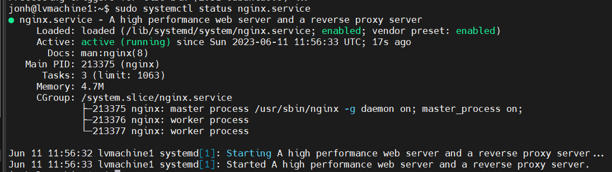

### Задание 1

Что такое балансировка нагрузки и зачем она нужна?

*Приведите ответ в свободной форме.*

---
Балансировка нагрузки (load balancing) — это процесс
распределения нагрузки на пул серверов , чтобы обеспечить эффективное использование ресурсов, повысить производительность системы и обеспечить надежность и отказоустойчивость.

Основные преимущества балансировки нагрузки включают:
- сокращение времени простоя
- масштабируемость
- отказоустойчивость
- эффективное использование ресурсов

---
### Задание 2

Чем отличаются алгоритмы балансировки Round Robin и Weighted Round Robin? В каких случаях каждый из них лучше применять?

*Приведите ответ в свободной форме.*

---
Round Robin - тот алгоритм равномерно распределяет запросы между серверами в кластере. Он работает по принципу "поочередности", где каждый сервер получает запрос в последовательном порядке.

Weighted Round Robin (WRR) - в отличие от простого Round Robin, WRR учитывает вес (приоритет) каждого сервера в кластере. Каждый сервер получает запросы пропорционально своему весу.

RR хорошо подходит, когда все серверы в кластере имеют одинаковую производительность , а также может быть полезен в случаях, когда не требуется учитывать дополнительные факторы при балансировке нагрузки.

WRR может быть полезным, когда серверы в кластере имеют различные производительности или характеристики, которые необходимо учитывать при балансировке нагрузки.

---
### Задание 3

Установите и запустите Haproxy.

*Приведите скриншот systemctl status haproxy, где будет видно, что Haproxy запущен.*

---

---
### Задание 4

Установите и запустите Nginx.

*Приведите скриншот systemctl status nginx, где будет видно, что Nginx запущен.*

---

---
### Задание 5

Настройте Nginx на виртуальной машине таким образом, чтобы при запросе:

`curl http://localhost:8088/ping`

он возвращал в ответе строчку:

"nginx is configured correctly".

*Приведите конфигурации настроенного Nginx сервиса и скриншот результата выполнения команды curl http://localhost:8088/ping.*

---

## Задания со звёздочкой*

Эти задания дополнительные. Их выполнять не обязательно. На зачёт это не повлияет. Вы можете их выполнить, если хотите глубже разобраться в материале.
### Задание 6*

Настройте Haproxy таким образом, чтобы при ответе на запрос:

`curl http://localhost:8080/`

он проксировал его в Nginx на порту 8088, который был настроен в задании 5 и возвращал от него ответ:

"nginx is configured correctly".

*Приведите конфигурации настроенного Haproxy и скриншоты результата выполнения команды curl http://localhost:8080/.*
