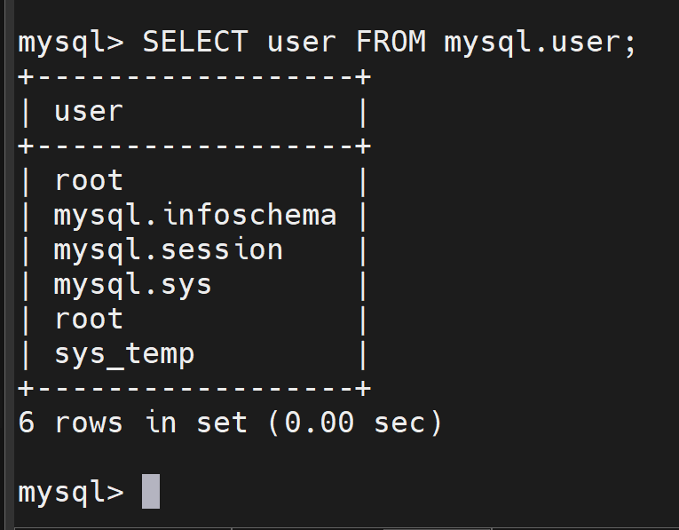
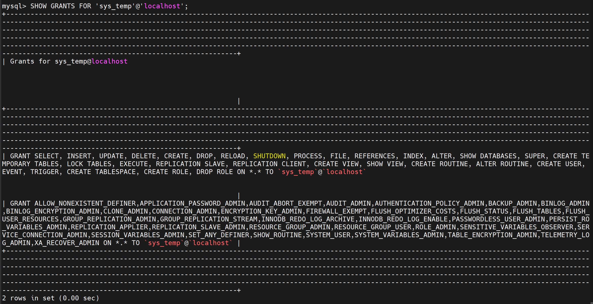
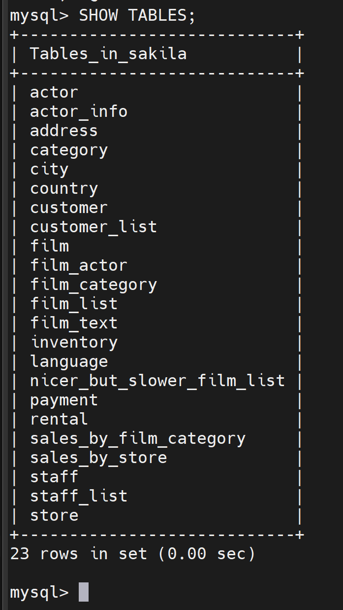
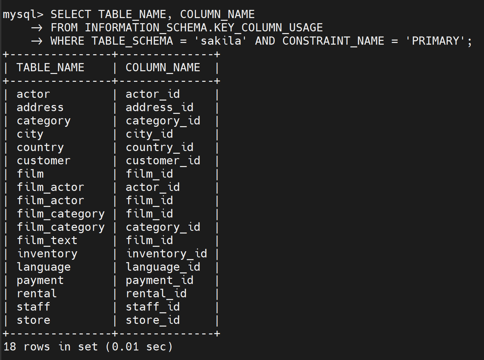

### Задание 1
1.1. Поднимите чистый инстанс MySQL версии 8.0+. Можно использовать локальный сервер или контейнер Docker.

1.2. Создайте учётную запись sys_temp. 

1.3. Выполните запрос на получение списка пользователей в базе данных. (скриншот)

1.4. Дайте все права для пользователя sys_temp. 

1.5. Выполните запрос на получение списка прав для пользователя sys_temp. (скриншот)

1.6. Переподключитесь к базе данных от имени sys_temp.

Для смены типа аутентификации с sha2 используйте запрос: 
```sql
ALTER USER 'sys_test'@'localhost' IDENTIFIED WITH mysql_native_password BY 'password';
```
1.6. По ссылке https://downloads.mysql.com/docs/sakila-db.zip скачайте дамп базы данных.

1.7. Восстановите дамп в базу данных.

1.8. При работе в IDE сформируйте ER-диаграмму получившейся базы данных. При работе в командной строке используйте команду для получения всех таблиц базы данных. (скриншот)

*Результатом работы должны быть скриншоты обозначенных заданий, а также простыня со всеми запросами.*

---
### Решение 1

```sql
CREATE USER 'sys_temp'@'localhost' IDENTIFIED BY '123';
```
```sql
SELECT user FROM mysql.user;
```


```sql
SHOW GRANTS FOR 'sys_temp'@'localhost';
```


```sql
mysql> exit
Bye
bash-4.4# mysql -u sys_temp -p
```
```sql
mysql> ALTER USER 'sys_temp'@'localhost' IDENTIFIED WITH mysql_native_password BY '123';
```
```sql
mysql> CREATE DATABASE sakila;
```
```
bash-4.4# mysql -u root -p sakila < sakila-schema.sql
```
```
bash-4.4# mysql -u root -p sakila < sakila-data.sql
```
```sql
mysql> USE sakila
```

```sql
mysql> SHOW TABLES;
```


---
### Задание 2
Составьте таблицу, используя любой текстовый редактор или Excel, в которой должно быть два столбца: в первом должны быть названия таблиц восстановленной базы, во втором названия первичных ключей этих таблиц. Пример: (скриншот/текст)
```
Название таблицы | Название первичного ключа
customer         | customer_id
```
---
### Решение 2

```sql
mysql> SELECT TABLE_NAME, COLUMN_NAME
    -> FROM INFORMATION_SCHEMA.KEY_COLUMN_USAGE
    -> WHERE TABLE_SCHEMA = 'sakila' AND CONSTRAINT_NAME = 'PRIMARY';
```

