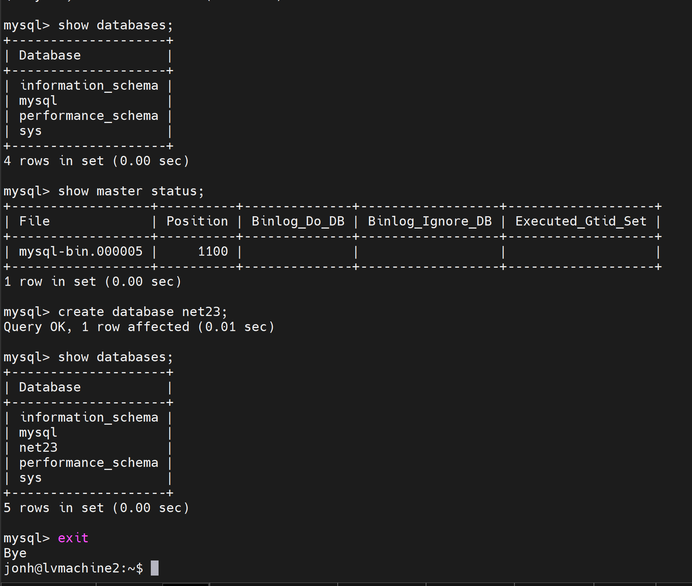
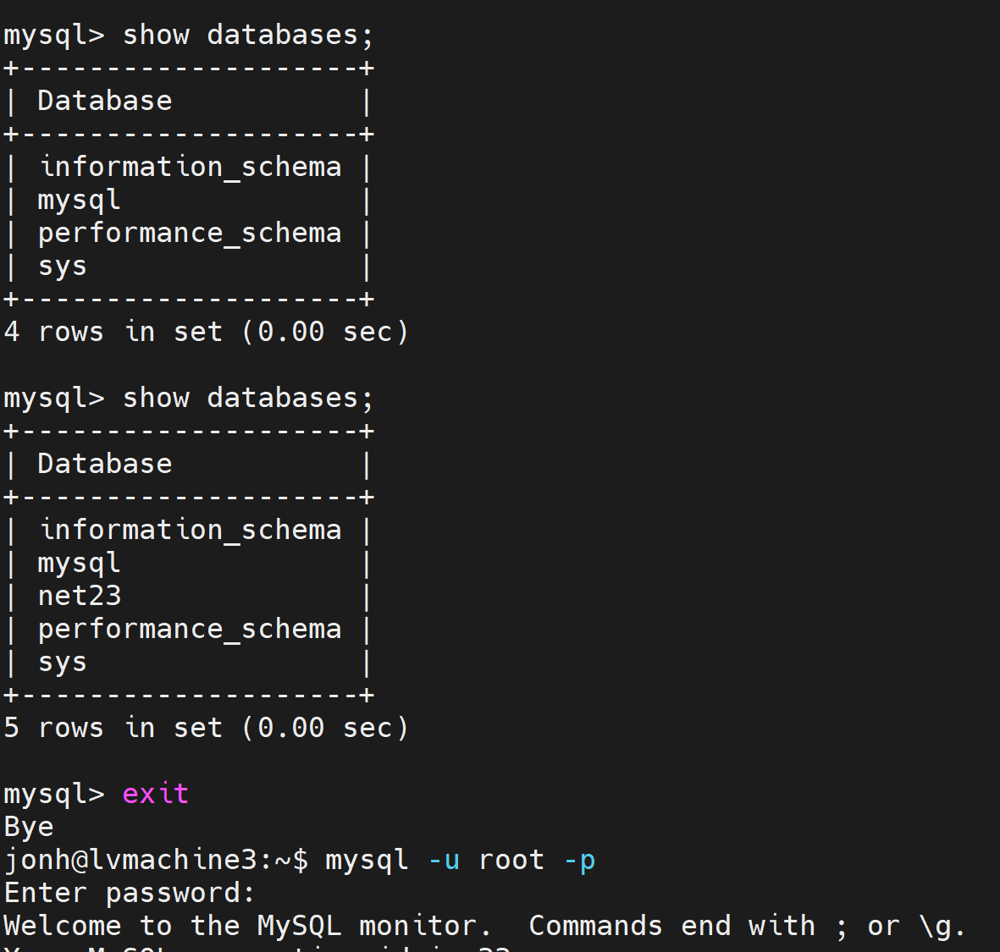
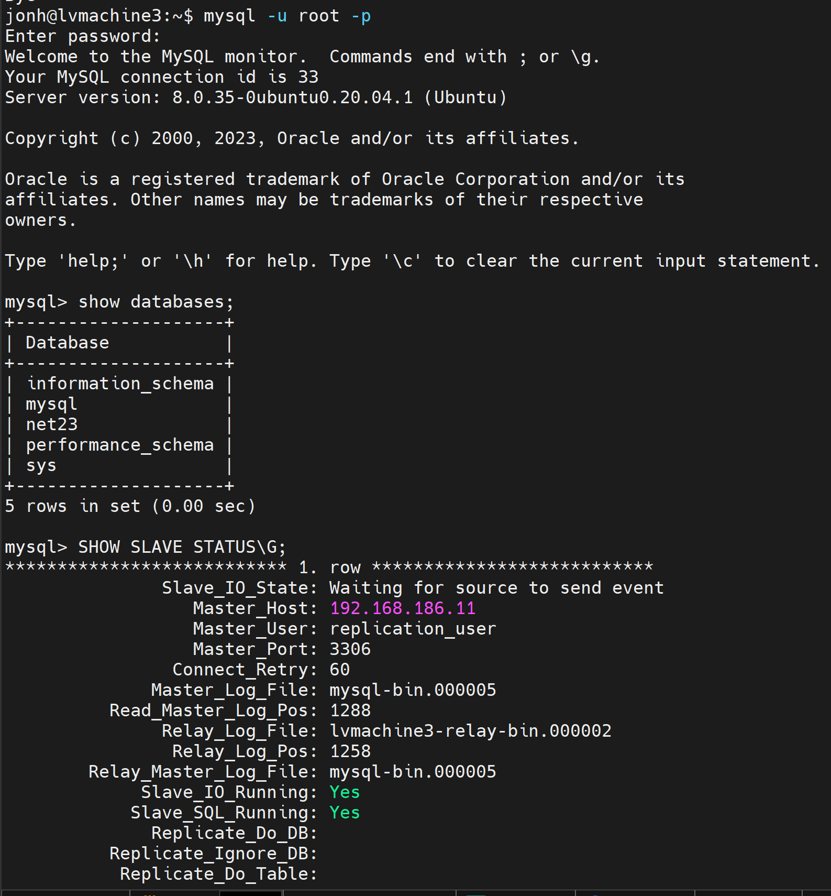

### Задание 1

На лекции рассматривались режимы репликации master-slave, master-master, опишите их различия.

*Ответить в свободной форме.*

---
### Решение 1

Репликация типа Master-Slave часто используется для
обеспечения отказоустойчивости приложений , позволяет распределить нагрузку на базу
данных между несколькими серверами (репликами).
На slave сервере база в режиме только чтения . Master-сервер может иметь множество slave-серверов. Это позволяет создавать реплицированные системы с большим количеством читающих узлов, что увеличивает масштабируемость системы для операций чтения

Master-Master репликации – это настройка обычной Master-Slave
репликации, только в обе стороны (каждый сервер является
мастером и слейвом одновременно).Одной из сложностей в master-master репликации является управление конфликтами. Если два сервера пытаются обновить одну и ту же запись одновременно, возникают конфликты.

Подитожив - Master-slave обеспечивает простую и асимметричную конфигурацию, подходящую для сценариев с высокой нагрузкой на чтение. Master-master репликация предоставляет более сложную и симметричную конфигурацию, что подходит для случаев, когда оба сервера могут принимать как операции записи, так и операции чтения. Однако управление конфликтами становится значительно сложнее в master-master конфигурации.

---
### Задание 2

Выполните конфигурацию master-slave репликации, примером можно пользоваться из лекции.

*Приложите скриншоты конфигурации, выполнения работы: состояния и режимы работы серверов.*

---

### Решение 2

#### Master 

#### Slave

