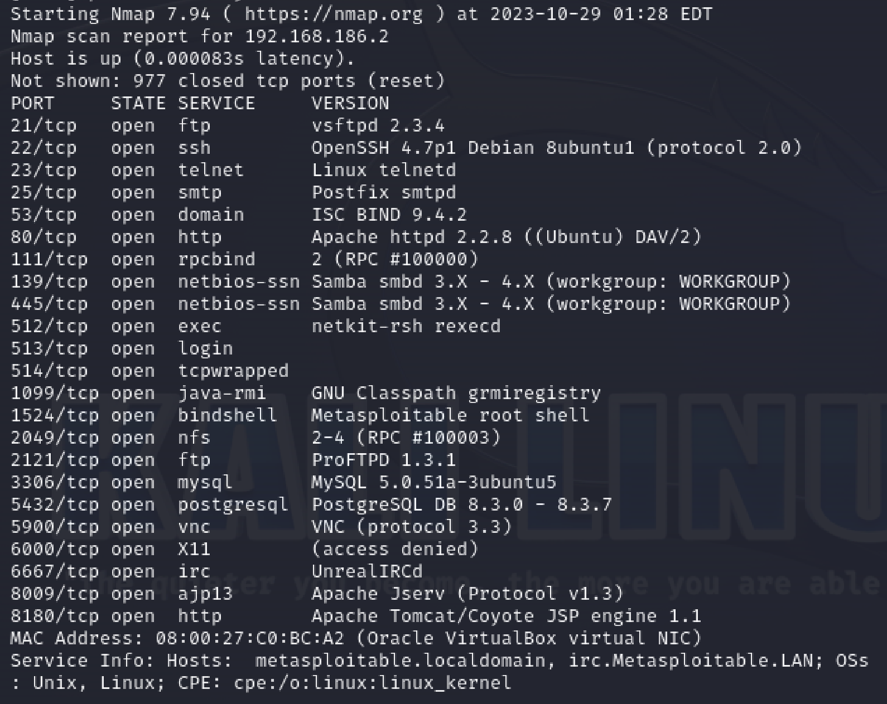
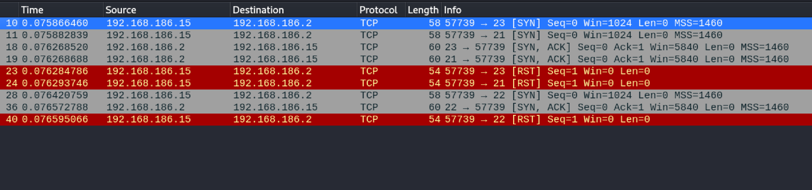
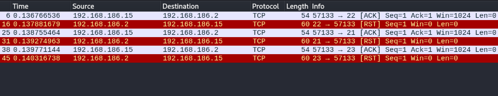
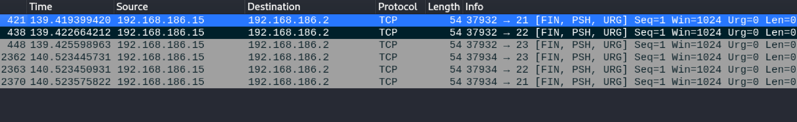
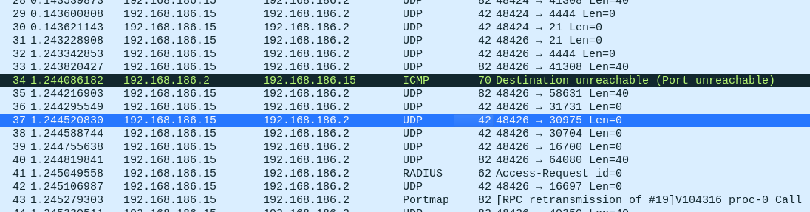

### Задание 1

Скачайте и установите виртуальную машину Metasploitable: https://sourceforge.net/projects/metasploitable/.

Это типовая ОС для экспериментов в области информационной безопасности, с которой следует начать при анализе уязвимостей.

Просканируйте эту виртуальную машину, используя **nmap**.

Попробуйте найти уязвимости, которым подвержена эта виртуальная машина.

Сами уязвимости можно поискать на сайте https://www.exploit-db.com/.

Для этого нужно в поиске ввести название сетевой службы, обнаруженной на атакуемой машине, и выбрать подходящие по версии уязвимости.

Ответьте на следующие вопросы:

- Какие сетевые службы в ней разрешены?
- Какие уязвимости были вами обнаружены? (список со ссылками: достаточно трёх уязвимостей)
  
*Приведите ответ в свободной форме.*  

---
### Решение 1

Было обнаружено много открытых портов , приведу пример трех сетевых служб 23 telnet , 22 ssh и 21 ftp.
Все эти службы имеют относительно старые версии ПО , для которых на сайте ест версии ехплоитов , шифровальщиков и тд например:
- 22/tcp   open  ssh         OpenSSH 4.7p1 Debian
OpenSSH 7.2p1 - (Authenticated) xauth Command Injection
https://www.exploit-db.com/exploits/39569
- 23/tcp   open  telnet      Linux telnetd
TelnetD encrypt_keyid 
https://www.exploit-db.com/exploits/18280
- 21/tcp   open  ftp         vsftpd 2.3.4
Exploit Title: vsftpd 2.3.4 - Backdoor Command Execution
https://www.exploit-db.com/exploits/49757

---
### Задание 2

Проведите сканирование Metasploitable в режимах SYN, FIN, Xmas, UDP.

Запишите сеансы сканирования в Wireshark.

Ответьте на следующие вопросы:

- Чем отличаются эти режимы сканирования с точки зрения сетевого трафика?
- Как отвечает сервер?

*Приведите ответ в свободной форме.*

---
### Решение 2

- SYN-сканирование: отправляются TCP-пакеты с установленным флагом SYN ,если порт открыт, сервер отвечает TCP-пакетом с установленными флагами SYN и ACK. Если порт закрыт, сервер отвечает TCP-пакетом с установленным флагом RST.

- FIN-сканирование: отправляются пакеты с флагом FIN если порт закрыт, сервер отвечает TCP-пакетом с флагом RST. Если открыт сервер может либо игнорировать пакет, либо отправить пустой ответ.

- Xmas-сканирование: отправляются TCP-пакеты с флагами FIN, URG, и PSH . Если порт закрыт, сервер может отправить пакет с флагом RST, если открыт игнорировать пакет или отправить пустой ответ.

- UDP-сканирование: отправляются UDP-пакеты , если порт закрыт, сервер может отправить ICMP пакет с сообщением о недостижимости порта. Если порт открыт, сервер может либо игнорировать пакет, либо отправить пустой ответ.
